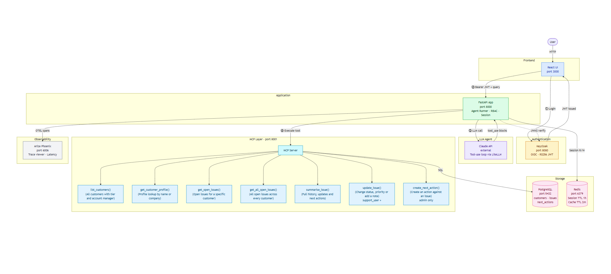

# Acme Operations Assistant

A full-stack agentic enterprise assistant built for Acme Operations. Internal users across sales, support, and operations can ask natural language questions about customers and issues. The assistant reasons over structured data using Claude's native tool-use, enforces role-based access control via Keycloak, and maintains conversation memory across a session using Redis.

Built as the EY Applied AI Engineer Technical Assessment submission.

---

## Setup Instructions

### Prerequisites

- Docker Desktop running
- An Anthropic API key

### Clone and run

```bash
git clone https://github.com/AbhishekSnap/Acme_Operations_Assistant_EY.git
cd Acme_Operations_Assistant_EY
cp .env.example .env
```

Open `.env` and set your API key:

```
ANTHROPIC_API_KEY=sk-ant-...
```

Then start everything:

```bash
docker compose up --build
```

First run takes 2-3 minutes while Docker pulls images and Keycloak imports the realm. Wait until all containers are healthy before opening the UI.

### Service URLs

| Service | URL | Notes |
|---|---|---|
| React UI | http://localhost:3000 | Main user interface |
| FastAPI app | http://localhost:8000 | REST API and health check |
| Keycloak admin | http://localhost:8080 | admin / admin |
| MCP Server | http://localhost:8001 | Tool schemas and execution |
| Arize Phoenix | http://localhost:6006 | Trace visualisation |
| PostgreSQL | port 5432 (internal) | Not exposed to host |
| Redis | port 6379 (internal) | Not exposed to host |

---

## Demo Guide

Open `DEMO_GUIDE.txt` in the root of the repo. It contains login credentials, a list of example queries for each user role, and suggested demo scenarios including RBAC enforcement and escalation briefs.

### User accounts

Password for all users: `Acme@2026!`

| Username | Role | Permissions |
|---|---|---|
| alice | sales_user | read |
| bob | support_user | read, update_issue |
| carol | admin | read, update_issue, create_next_action |

### Role permissions in detail

**alice / sales_user**
- Look up customer profiles
- View open issues for any customer
- Cannot update issues or create next actions

**bob / support_user**
- Everything alice can do
- Update issue status and priority
- Add progress notes to issues
- Cannot create next actions

**carol / admin**
- Full access
- Create next actions against issues
- Trigger escalation briefs (multi-step skill workflow)

---

## Observability - Arize Phoenix

Phoenix is an open-source LLM observability platform running at **http://localhost:6006**.

It captures every request as a trace with child spans for each tool call and LLM turn. Open it after running a few queries to see:

- The full span tree for each request (which tools were called, in what order)
- Latency per tool call and per LLM turn
- Input and output for each step
- Request history across all users

This is useful during the demo to show the agent's reasoning path - for example, an escalation brief trace will show `get_customer_profile`, `get_open_issues`, and two `summarise_issue` spans all nested under one root request.

All traces are also written to `logs/traces.jsonl` as a local backup and as the source for the evaluation runner.

---

## Evaluation

The eval suite runs 10 questions against the live application and scores five dimensions: tool selection, data grounding, RBAC enforcement, next action quality, and response reasonableness.

### Install dependency

```bash
pip install httpx
```

Or if using a virtual environment:

```bash
python -m venv .venv
source .venv/bin/activate   # Windows: .venv\Scripts\activate
pip install httpx
```

### Run

The application must be running before executing the eval.

```bash
python eval/run_eval.py
```

Results are printed to the terminal with colour-coded PASS/FAIL per question and written to `eval/eval_results.json`.

### What is tested

| Question | User | Scenario |
|---|---|---|
| Q01 | alice | Customer profile lookup |
| Q02 | alice | Open issues for a customer |
| Q03 | bob | Issue history summary |
| Q04 | carol | Create next action (admin allowed) |
| Q05 | alice | Create next action (sales_user blocked) |
| Q06 | carol | Escalation brief (multi-tool skill) |
| Q07 | bob | Recommended next actions via issue summary |
| Q08 | bob | Cross-customer critical issue listing |
| Q09 | alice | Out-of-scope query (graceful decline) |
| Q10 | bob | Multi-step chained tool use |

Current score: **10/10**

---

## Architecture

Seven Docker containers on a shared Compose network. The React UI authenticates against Keycloak and receives a JWT. The FastAPI app validates that token locally via JWKS, then routes the query to the agent runner. The runner calls Claude via LiteLLM, executes tool calls via HTTP against the MCP server, and loops until Claude signals completion. Redis holds session memory and tool result cache. PostgreSQL is the durable store. Arize Phoenix provides trace visualisation.



### Component responsibilities

| Component | Port | Role |
|---|---|---|
| **React UI** | 3000 | Browser interface, dark/light theme, markdown rendering |
| **FastAPI app** | 8000 | API gateway, auth middleware, agent orchestration |
| **MCP Server** | 8001 | Owns all tool definitions and SQL; exposes them via HTTP + SSE |
| **Keycloak** | 8080 | OIDC token issuer; realm `acme` imported at startup |
| **Arize Phoenix** | 6006 | Trace visualisation and latency monitoring |
| **PostgreSQL** | 5432 (internal) | Durable store: customers, issues, updates, next actions |
| **Redis** | 6379 (internal) | Session history (TTL 1h), cached tool results (TTL 2m) |
| **Claude API** | external | Reasoning engine - selects tools dynamically based on query |

### Design decisions and scalability

LangGraph and LangChain were considered but not used. The agent is implemented as a native tool-use loop: Claude receives tool schemas, returns `tool_use` blocks, results are fed back, and the cycle continues until `end_turn`. This is more transparent and easier to reason about than a compiled state graph. LangGraph earns its complexity when you need branching workflows or parallel agent execution; neither applies here.

The architecture scales to multiple agents without structural change. Any agent can consume the same MCP server - tool definitions and SQL stay in one place. Adding a specialist agent (Analytics, Billing) means pointing it at the same `GET /tools` endpoint. Redis and Keycloak extend automatically since both are stateless. Only the routing logic changes, not the infrastructure.

### Agent design

The agent uses Claude's native tool-use API directly - no LangChain or LangGraph. The loop:

1. Build messages from Redis session history and the current query
2. Call Claude with tool schemas fetched from the MCP server
3. Claude returns `tool_use` blocks - execute each via MCP HTTP call
4. Append results as `tool_result` blocks and loop
5. On `end_turn` - return Claude's final text response

Tool schemas live entirely in the MCP server. The agent core has no hardcoded SQL.

### MCP (Model Context Protocol)

MCP decouples tool definitions from the agent core. The FastAPI app fetches schemas from `GET /tools` at startup - adding a new tool to the MCP server requires no changes to the agent. In a larger deployment, multiple agents with different models could share one MCP server.

The MCP server runs as its own container (`acme-mcp`) so tool code that touches the database is isolated from agent orchestration logic.

### Escalation Skill

The Customer Escalation Summary Skill (`app/skills/escalation.py`) is a deterministic multi-step workflow, distinct from a freeform agent call. It always runs: `get_customer_profile`, then `get_open_issues`, then `summarise_issue` for each issue, then one LLM call with all collected data to produce a structured brief. Triggered by phrases like "escalation brief" or "executive summary".

---

## Trade-offs

| Decision | What was done | Production alternative |
|---|---|---|
| Streaming | Simulated - response chunked after completion | Full async streaming with `stream=True` in Anthropic SDK |
| Keycloak | Dev-mode with embedded H2 database | Production config: external PostgreSQL, TLS, replicas |
| Observability | JSONL files + Arize Phoenix | OpenTelemetry collector exporting to Jaeger or Datadog |
| Session memory | Last 20 turns in Redis (windowed) | Vector store for semantic recall over long histories |
| MCP transport | HTTP + SSE | stdio transport for local in-process tools |
| Tool auth | Checked in MCP server per request | Dedicated authorisation service or OPA policy engine |

---

## AI Tool Usage Notes

See [`AI_USAGE_NOTES.md`](AI_USAGE_NOTES.md) for a full account of what was delegated to AI, what was reviewed and corrected by hand, and what would not be trusted to AI on a client engagement.

---

## Project Structure

```
.
├── docker-compose.yml
├── .env.example
├── reset_demo.sh            # Clears Phoenix, logs, and Redis before a demo
├── AI_USAGE_NOTES.md
├── app/
│   ├── main.py              # FastAPI app entry point
│   ├── config.py            # Pydantic settings
│   ├── auth/
│   │   └── keycloak.py      # JWT validation, RBAC helpers
│   ├── agent/
│   │   ├── runner.py        # Claude tool-use loop
│   │   └── mcp_client.py    # HTTP client for MCP server
│   ├── skills/
│   │   └── escalation.py    # Customer Escalation Summary Skill
│   ├── api/
│   │   ├── routes.py        # /chat, /skills, /admin endpoints
│   │   └── auth_routes.py   # /auth/token (demo login helper)
│   ├── db/
│   │   └── database.py      # asyncpg connection pool
│   ├── cache/
│   │   └── redis_client.py  # Session memory and cache helpers
│   └── observability/
│       └── tracer.py        # JSONL trace writer + OTEL exporter
├── mcp_server/
│   └── main.py              # MCP server: tool schemas and SQL execution
├── infra/
│   ├── keycloak/
│   │   └── acme-realm.json  # Realm import: roles, clients, users
│   └── postgres/
│       └── init.sql         # Schema and seed data
├── acme-ui/
│   ├── src/
│   │   ├── App.jsx          # React UI with dark/light theme
│   │   └── App.css          # EY-branded CSS custom properties
│   └── package.json
└── eval/
    ├── questions.json        # 10 test questions
    ├── requirements.txt      # httpx
    └── run_eval.py           # Evaluation runner
```
